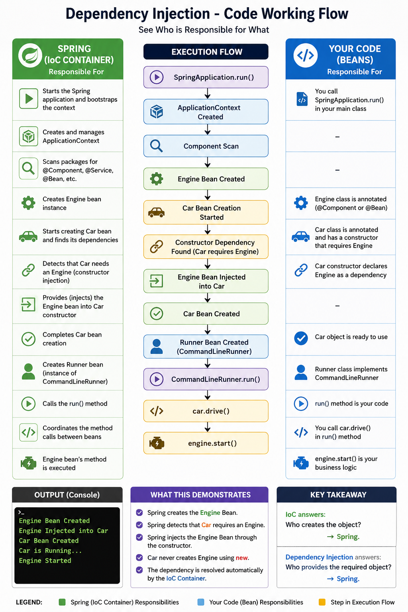

# Dependency Injection - Code Working Flow

## Execution Flow

```
SpringApplication.run()

        │
        ▼

ApplicationContext Created

        │
        ▼

Component Scan

        │
        ▼

Engine Bean Created

        │
        ▼

Car Bean Creation Started

        │
        ▼

Constructor Dependency Found
(Car requires Engine)

        │
        ▼

Engine Bean Injected into Car

        │
        ▼

Car Bean Created

        │
        ▼

Runner Bean Created

        │
        ▼

CommandLineRunner.run()

        │
        ▼

car.drive()

        │
        ▼

engine.start()
```

---

## Output

```
Engine Bean Created
Engine Injected into Car
Car Bean Created
Car is Running...
Engine Started
```

---

## What This Demonstrates

- Spring creates the Engine Bean.
- Spring detects that Car requires an Engine.
- Spring injects the Engine Bean through the constructor.
- Car never creates Engine using `new`.
- The dependency is resolved automatically by the IoC Container.

---

## Key Takeaway

IoC answers:

> **Who creates the object?**

Spring.

Dependency Injection answers:

> **Who provides the required object?**

Spring.
